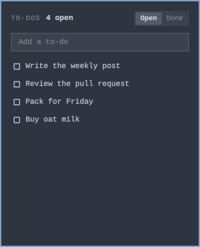

# Simple To-Do List for Omarchy

A small persistent to-do list in the Omarchy bar. Click the chip to add,
check off, search done items, and restore them.

No accounts. No cloud. Just a JSON file on disk.



## Install

```bash
omarchy plugin add https://github.com/MayberryDT/omarchy-todo-list.git --enable
omarchy restart shell
```

The widget lands on the right of the bar by default. Move it with:

```bash
omarchy bar move io.zet.todo-list
```

## Usage

- **Left click** the bar chip to open the panel
- **Open** — type a to-do and press Enter
- **Check off** — pop + sound, item moves to Done
- **Done** — search completed items; click a row to restore it to Open
- **Hover a row** and click **X** to delete

## Keyboard

- Type a to-do and press **Enter**
- **Down** jumps to the list; **Up** from the first row returns to the field
- **Up / Down** or **j / k** move
- **Enter** or **Space** checks off (Open) or restores (Done)
- **x** or **Delete** removes the selected row
- **Left / Right** switches Open and Done
- **Escape** goes back to the field, then closes
- **Tab** moves to the next bar panel
- **/** focuses the field again

## Data

To-dos are stored at:

```
~/.config/omarchy/todo-list/items.json
```

The bar watches that file, so another tool or agent can read and write it.

## Remove

```bash
omarchy plugin remove io.zet.todo-list --yes
omarchy restart shell
```

That uninstalls the widget. It does **not** delete `~/.config/omarchy/todo-list/items.json`. Remove that folder yourself if you want the list gone too.

## Requirements

Omarchy 4 with Quickshell. `pw-play` (PipeWire) for the check-off sound; the plugin still works without it.

## License

MIT
